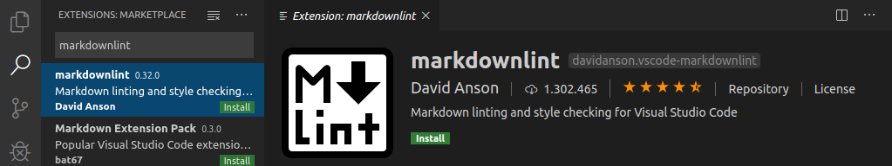
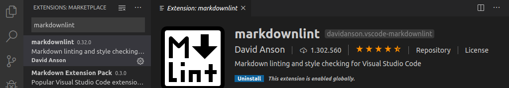
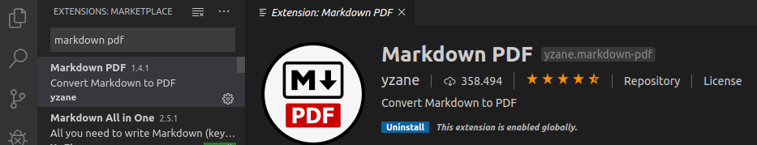
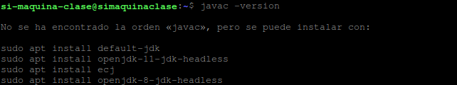
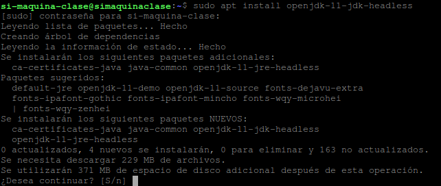
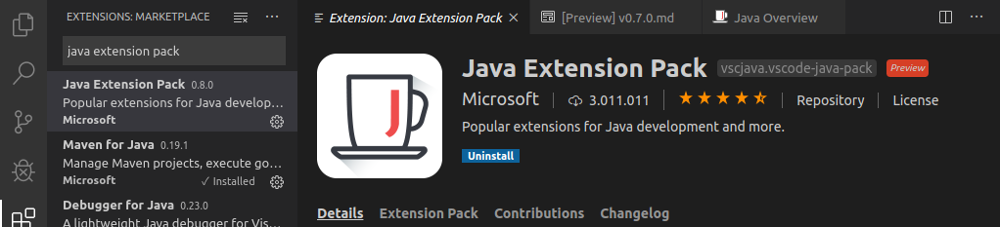
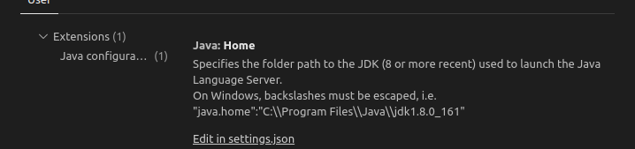
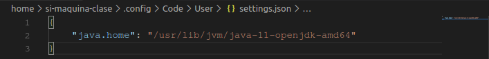

**Francisco Javier Gimeno Ortiz_EDD_1º DAM**

# Instalació extensions VSCode

## Instalació MarkDownLint

1.- Partint d'una instalació nova de Visual Studio Code, farem clic a la icona d'una lupa a l'esquerra de la finestra, veurem que sens obrirà un apartat amb una barra de busquera, en aquesta barra, aurem de escriure "markdownlint", açó ens mostrarà els resultats de busqueda entre el repositori de extensions de VSCode.

Podem veure com a la imatge de dalt poder trobar la extensió, pues tenim que donar-li a "install" (botó verd a la finestra de l'extensió), al fer açó, la extensió començara a instalar-se, quan acabe veurem que el botó verd ara es blau i posa "uninstall", no li doneu al botó ja que açó desinstalaría l'imatge, pues léxtensió ja estaría instalada.

## MarkDown PDF

1.- La instalació d'aquesta ( i cualsevol altra ) es igual, només tindriem que buscar "markdown PDF" i ja en eixiría, has de seguir el mateixos pasos que a la extensió anterior:

## Java Extension Pack

 - Per a instalar aquesta extensió, necesitarem instalar primer "java" o "openjdk" al nostre sistema, per fer-ho, necesitarem obrir una terminal en el sistema operatiu, on escriurem el següent comandament per vore si ja tenim java instalat (ademés de quina versió si es que ja està instalat):
 - javac -version

 - Acte seguit, en cas de no tindre java instalat, ( pots botarte aquest pas en cas de ja tindrel instalat), executarem el següent comandament:
 - sudo apt install openjdk-11-jdk-headless

 
 - Una vegada ja tenim Java instalat, podem procedit a instalar la extensió com ja hem fet previament.

 - Una vegada instalada la extensió, hi ha que configurar-la per a que sapiga quina instalació de java, per fer açó, farem clic en "ctrl+h" i escriurem "Java:home".

 - Una vegada fet lo anterior, podem procedir a fet clic en "edit in settings.json", en la finestra que se obrirá, modificarem el arxiu a imatge de la següent imatge:

 - Una vegada fet açó, ja podriem fer us de Java en Visual Studio Code.
