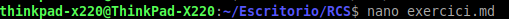
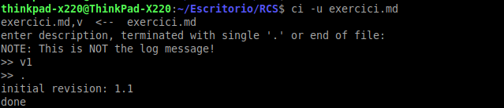
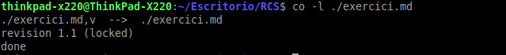
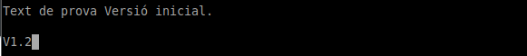
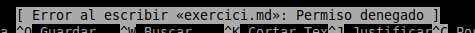
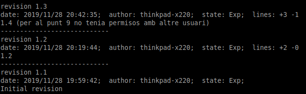
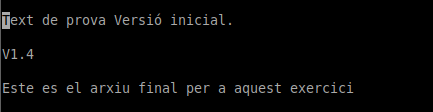

## Francisco Javier Gimeno Ortiz
## Entorns de desenvolupament 2019-2020

# Tema3: RCS

## Exercici:

1. Creeu un fitxer anomenat exercici.md, i afegiu-li algun contingut en format Markdwon. 

2. Registreu el fitxer per a que el controle RCS. 

3. Intenteu modificar el fitxer, per veure si teniu o no permís.

4.  Feu un checkout del fitxer, ara sí, per afegir canvis. 

5.  Modifiqueu el fitxer i afegiu-li més contingut. Aquesta serà la versió 1.2. 

6.  Amb un altre usuari, intenteu modificar el fitxer (fent el checkout abans). 

7.  Com a l’usuari original, registreu els canvis al fitxer. 

	Al no tindre permisos abans, no he pogut realitzar aquesta tarea.

8.  Amb l’altre usuari de nou, intenteu ara modificar el fitxer (també fent un checkout). 

	Mateix error d'abans, amés no deixa fer el checkout.

9.  Si podeu, afegiu més informació al fitxer, ara serà la versió 1.3.

	El mateix que al cas anterior.

 
10.  Com a l’usuari original, visualitzeu les diferències entre les versions, i torneu a la versió 1.2. 

11.  Apliqueu més canvis i guardeu-los amb la versió 1.4.

