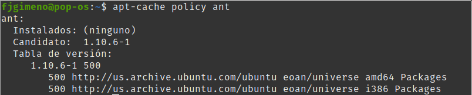
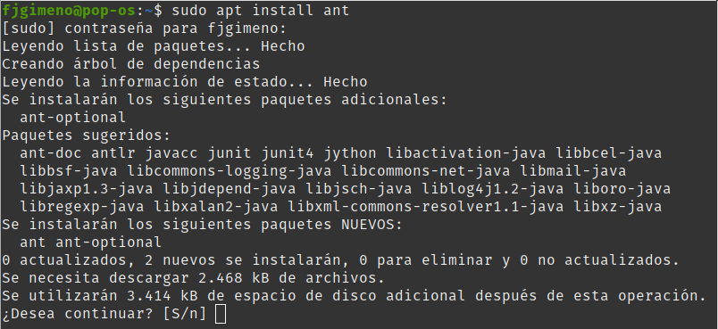
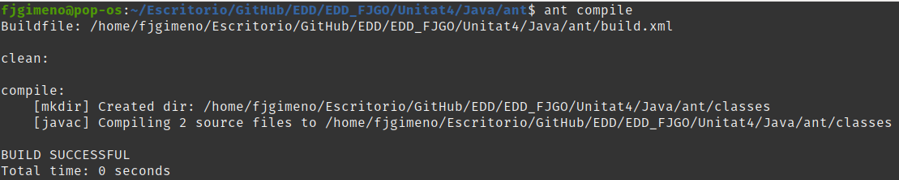
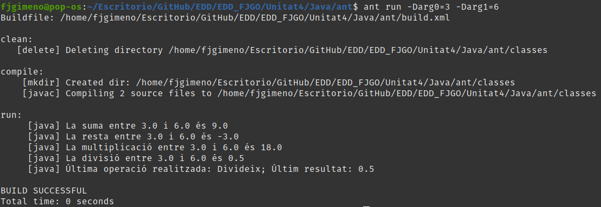

Francisco Javier Gimeno Ortiz
___
**Compilaciò ANT**

Per poder fer el següent, devem haver creat previament les classes Calcula y calculadora.
___
Una vegada creades les classes ( fitxers calcula.java i calculadora.java ), hem de crear el arxiu "build.xml", que s'utilitzarà per automatizar el procés de construcció.

 1. **Creació del arxiu "build.xml":** 	Utilitzaré el mateix que està inclos al PDF del temarí, per crearlo, copiarem el següent "codi" en un arxiu buit i el guardarém amb el nom "build.xml".
    ```
<project>
    <target name="clean">
        <delete dir="classes" />
    </target>

    <target name="compile" depends="clean">
        <mkdir dir="classes" />
    <javac includeantruntime="false" srcdir="com/ieseljust/edd/calc" destdir="classes" />
    </target>

    <target name="run" depends="compile">
        <java classpath="classes" classname="com.ieseljust.edd.calc.Calcula">
            <arg value="${arg0}"/>
            <arg value="${arg1}"/>
        </java>

    </target>
</project>
	```

 2. **Instalació de ANT:** Primer hem de comprovar que el paquet "ant" no estiga instalat ja en el nostre equip, per fer-ho, tan sols hem d'obrir un terminal i executar "apt-cache policy ant", en cas de que el comandament ens mostre que no tenim cap versio de "ant" instalada, l'instalarem amb "sudo apt install ant".




 3. **Compilació / Execució amb ANT:** Per tal de compilar el programa, obrirem un terminal y ens situarem a la mateixa altura del arxiu "build.xml", una vegada ahí, executarem el comandament "ant compile", una vegada compilat, executarem el programa amb "ant run -Darg0=X -Darg1=Y" on "X" e "Y" son numeros.



